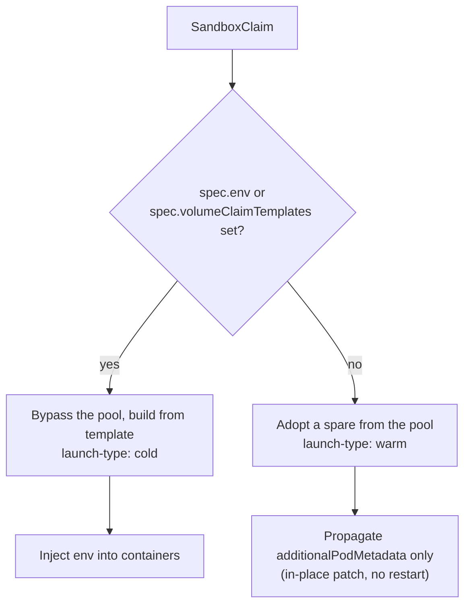
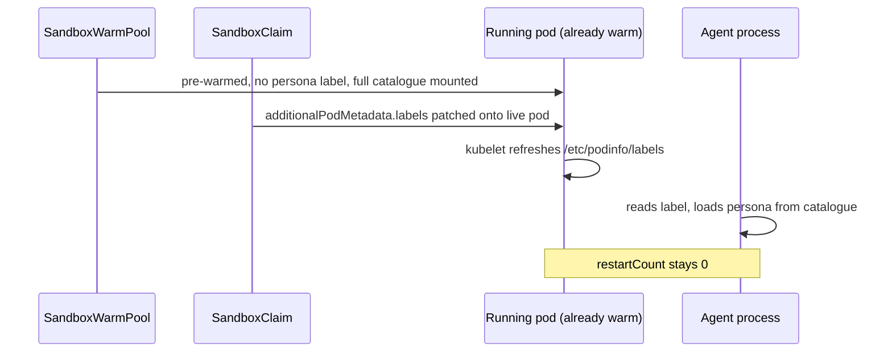

# Multi-persona warm pool

Serve **many agent personas from one warm pool**, and **re-target a running one**, without giving up
the warm start.

`SandboxClaim.additionalPodMetadata` is the one per-claim field that survives warm adoption
([KEP-0174](../../docs/keps/174-metadata-propagation/)). Existing examples use it to carry *identity*
— which user or employee a spare belongs to. This one uses it to carry **behaviour**: the label
selects a persona from a catalogue every pod already has, projected in through a
[downward API](https://kubernetes.io/docs/tasks/inject-data-application/downward-api-volume-expose-pod-information/)
volume, so the agent switches character with **no pod restart** — and can be switched again later
while it is still claimed and serving.

> [!NOTE]
> This example assumes you already know the three extension CRDs. If not, start with
> [warmpool-quickstart](../warmpool-quickstart) and come back.
>
> For the metadata channel used for per-user *identity* and external routing, see
> [hermes-agents-as-a-service](../hermes-agents-as-a-service) and
> [openclaw-fleet-gke](../openclaw-fleet-gke).

## The problem

You run four agent personas — an SRE observer, a security auditor, a FinOps optimiser, an incident
responder. You want warm starts for all of them.

The naive answer is one warm pool per persona. That is a combinatorial trap: `personas × spares`
pods sitting idle, and every new persona adds another pool to size, scale, and pay for. Four
personas at three spares each is twelve idle pods to serve a workload that never needs more than
three at once.

What you want is **one pool of fungible spares**, with the persona chosen at claim time.

## Why this is harder than it looks

A warm sandbox's pod is **already running** when the claim arrives. That single fact decides
everything:

| You mutate | Kubernetes must | Result |
| --- | --- | --- |
| `env`, `volumes`, `volumeMounts`, `serviceAccountName` | recreate the pod | ❌ cold start |
| `labels`, `annotations` | patch metadata in place | ✅ stays warm |

The controller implements exactly that split. On the warm-adoption path the **only** thing
propagated from the claim to the sandbox is `additionalPodMetadata`. Env injection lives solely on
the cold path, in the code that stamps `agents.x-k8s.io/launch-type: cold`.



So `additionalPodMetadata` is the one lever that survives warm adoption. This example is about
turning that one lever into a full persona switch.

## How it works

Every pod in the pool is byte-identical and carries the **entire persona catalogue**. The claim
contributes one label. A downward API volume — declared once in the `SandboxTemplate`, so it costs
nothing at claim time — projects that label into the container as a file. A small watcher notices
the file change and activates the matching persona.



The watcher here ([`scripts/activate-persona.sh`](scripts/activate-persona.sh)) is a busybox poll
loop that copies the selected file into place, standing in for whatever your real agent does —
re-read a system prompt, POST to a local admin endpoint, send `SIGHUP`. The example deliberately
builds **no container image** so you can run it as-is.

### The three mechanisms, ranked

| Mechanism | Warm-safe | Restart | Use it for |
| --- | :---: | :---: | --- |
| `additionalPodMetadata.labels` → downward API | ✅ | none | persona selection, routing, tenancy tags |
| Runtime HTTP injection via `status.serviceFQDN` | ✅ | none | large or secret payloads fetched after start |
| `spec.env` / `spec.volumeClaimTemplates` | ❌ | full cold start | genuinely per-tenant config, when you accept the cost |

## Label rules you will hit

Three rules the controller enforces. The first two are not written down anywhere; the third is a
documented design principle that is still easy to walk into.

> [!IMPORTANT]
> **1. The key must be in the label-domain allowlist.** It defaults to `sandbox.users.io`, so
> `example.com/persona` is rejected outright. Use `sandbox.users.io/persona`.
>
> **2. Never use a system-reserved prefix.** `agents.x-k8s.io/persona` — the intuitive choice — is
> silently dropped during propagation. No error, no label.
>
> **3. The template must NOT pre-declare the key.** This is KEP-0174's
> [Safety Principle: No Overrides](../../docs/keps/174-metadata-propagation/) — a claim may *add* a
> label but never *override* one the template already defines. The consequence is easy to miss:
> putting a sensible-looking default in the template makes **every** claim fail.
>
> ```text
> metadata override conflict: label "sandbox.users.io/persona" is defined in
> template with value "unassigned", but claim requests "sre-observer"
> ```

## RBAC decides your pool boundaries

`serviceAccountName` is part of the pod spec, which is stamped **before** any claim exists. A pool
therefore has exactly one identity.

- Personas that differ only in **behaviour** share a pool. The three observers do.
- Personas that differ in **Kubernetes permissions** need their own pool. The incident responder
  can delete pods and scale deployments, so it gets `remediator-pool`.

Two pools, four personas — sized by trust boundary, not by persona. That is the honest shape of
this pattern, and the reason it does not collapse into "one pool per everything".

## Files

| File | Purpose |
| --- | --- |
| [`00-prereqs.yaml`](00-prereqs.yaml) | Namespace, two ServiceAccounts, the observer/remediator RBAC split |
| [`10-sandboxtemplate-observer.yaml`](10-sandboxtemplate-observer.yaml) | Pool A template: downward API volume, catalogue mounts, `Disallowed` policies |
| [`11-sandboxtemplate-remediator.yaml`](11-sandboxtemplate-remediator.yaml) | Pool B template: identical except `serviceAccountName` |
| [`20-warmpools.yaml`](20-warmpools.yaml) | Both `SandboxWarmPool`s (3 spares + 1) |
| [`30-claims-observer.yaml`](30-claims-observer.yaml) | Three claims, one shared pool, one label apart |
| [`31-claim-remediator.yaml`](31-claim-remediator.yaml) | Fourth persona, other trust boundary |
| [`40-antipattern-env.yaml`](40-antipattern-env.yaml) | The `spec.env` trap, to be observed failing |
| [`personas/`](personas/) | The catalogue: four persona definitions with frontmatter |
| [`scripts/activate-persona.sh`](scripts/activate-persona.sh) | Watches the projected label, activates the persona |
| [`run-test-gke.sh`](run-test-gke.sh) | Non-interactive walkthrough with computed verdicts |

## Walkthrough

Requires agent-sandbox **with extensions** installed. On any cluster:

```sh
kubectl apply --server-side -f \
  https://github.com/kubernetes-sigs/agent-sandbox/releases/latest/download/sandbox-with-extensions.yaml
```

Locally, `EXTENSIONS=true make deploy-kind` does the same against a kind cluster.

### 1. Prereqs, catalogue, pools

```sh
kubectl apply -f 00-prereqs.yaml

# The catalogue and the watcher are ordinary ConfigMaps built from this directory.
kubectl -n multi-persona-demo create configmap persona-catalog --from-file=personas/
kubectl -n multi-persona-demo create configmap persona-activator --from-file=scripts/activate-persona.sh

kubectl apply -f 10-sandboxtemplate-observer.yaml \
  -f 11-sandboxtemplate-remediator.yaml \
  -f 20-warmpools.yaml
```

Wait for the spares, and note they have **no persona** yet:

```sh
kubectl -n multi-persona-demo get sandbox -L agents.x-k8s.io/launch-type,sandbox.users.io/persona
```

### 2. Claim three personas from one pool

```sh
kubectl apply -f 30-claims-observer.yaml -f 31-claim-remediator.yaml
kubectl -n multi-persona-demo get sandboxclaim
```

Each claim differs from its siblings by a single line:

```yaml
spec:
  warmPoolRef:
    name: observer-pool
  additionalPodMetadata:
    labels:
      sandbox.users.io/persona: security-auditor   # <-- the only difference
```

### 3. Confirm it stayed warm

```sh
kubectl -n multi-persona-demo get sandbox -L agents.x-k8s.io/launch-type,sandbox.users.io/persona
```

`launch-type=warm` on every one. The persona is live inside the container:

```sh
SB=$(kubectl -n multi-persona-demo get sandboxclaim agent-sre -o jsonpath='{.status.sandbox.name}')
kubectl -n multi-persona-demo exec "$SB" -c agent -- cat /etc/podinfo/labels
kubectl -n multi-persona-demo exec "$SB" -c agent -- head -3 /opt/active/persona.md
```

And the pod never restarted — compare its start time against the claim's creation time:

```sh
kubectl -n multi-persona-demo get pod "$SB" \
  -o jsonpath='{.status.startTime}{"  restarts="}{.status.containerStatuses[0].restartCount}{"\n"}'
kubectl -n multi-persona-demo get sandboxclaim agent-sre -o jsonpath='{.metadata.creationTimestamp}{"\n"}'
```

The pod **predates its own claim**. That is the proof it was adopted rather than created.

### 4. Reassign a persona on a live sandbox

Because the persona is only a label, it can be changed on a sandbox that is already claimed and
serving:

```sh
kubectl -n multi-persona-demo patch sandboxclaim agent-sre --type merge \
  -p '{"spec":{"additionalPodMetadata":{"labels":{"sandbox.users.io/persona":"finops-optimizer"}}}}'

kubectl -n multi-persona-demo exec "$SB" -c agent -- head -3 /opt/active/persona.md
kubectl -n multi-persona-demo logs "$SB" -c agent --tail=5
```

The pod's `restartCount` is still `0`.

### 5. Watch `spec.env` forfeit the pool

```sh
kubectl apply -f 40-antipattern-env.yaml
kubectl -n multi-persona-demo get sandbox -L agents.x-k8s.io/launch-type
```

That a claim carrying `spec.env` or `spec.volumeClaimTemplates` bypasses the pool is **deliberate
upstream design**, not a bug: see
[KEP-0208](../../docs/keps/208-mutually-exclusive-field-in-sandboxclaim/), and
[#1480](https://github.com/kubernetes-sigs/agent-sandbox/issues/1480) where in-band post-adoption
injection was considered and rejected. Two spares sit warm in `antipattern-pool` and the claim uses
**neither**.

What is worth seeing for yourself is how *differently* the two policies report it:

```text
envVarsInjectionPolicy: Disallowed   ->  claim REJECTED, never binds   (loud)
envVarsInjectionPolicy: Allowed      ->  claim SUCCEEDS, cold-starts   (silent)
```

Under `Allowed` the claim goes `Ready` with no error, no warning and no event, and every request has
quietly stopped using the pool you are paying to keep warm. The only trace is the controller-set
`agents.x-k8s.io/launch-type=cold`.

That is why both real templates here set `envVarsInjectionPolicy: Disallowed` — it turns a silent
cost regression into a loud failure. Use `Allowed` deliberately, for claims that genuinely need
pod-spec customisation and can pay the cold start.

### 6. Clean up

```sh
kubectl delete namespace multi-persona-demo
kubectl delete clusterrole,clusterrolebinding multi-persona-observer multi-persona-remediator
```

## Run the whole thing as a test

```sh
./run-test-gke.sh
```

It executes the walkthrough end to end and **computes** each verdict from cluster state rather than
asserting a hardcoded banner. The headline pair cannot pass vacuously:

```text
claims with additionalPodMetadata  -> expect launch-type=warm   (pool preserved)
claim with spec.env                -> expect launch-type=cold   (pool forfeited)
```

It additionally proves adoption rather than creation (each bound sandbox must appear in a snapshot
taken *before* any claim existed), asserts `restartCount == 0`, checks the persona actually loaded
*inside* the container, and refuses to score the cold-start check unless the anti-pattern pool
really had spares of its own to waste.

> [!NOTE]
> Nothing in this example is GKE-specific — it needs only `downwardAPI` volumes, ConfigMaps, and
> the `busybox` image, so it should run on any cluster with the extension CRDs installed. The `gke`
> suffix records where it was actually exercised (GKE Autopilot, Kubernetes 1.35), not a
> restriction.

## Scope

Warm-pool mechanics themselves are covered elsewhere; this example links out rather than
re-explaining them.

| Topic | Go to |
| --- | --- |
| The three extension CRDs | [warmpool-quickstart](../warmpool-quickstart) |
| Multi-tenant platform shape, suspend/resume, PVC state | [hermes-agents-as-a-service](../hermes-agents-as-a-service) |
| Enterprise fleet: per-employee storage, routing, sleep/wake | [openclaw-fleet-gke](../openclaw-fleet-gke) |
| Scaling a pool | [hpa-swp-scaling](../hpa-swp-scaling), [keda-scale-to-zero](../keda-scale-to-zero) |
| Pre-warming from a snapshot | [podsnapshot-golden-warmpool](../podsnapshot-golden-warmpool) |

### How this differs from the other metadata-channel examples

`hermes-agents-as-a-service` and `openclaw-fleet-gke` both put a `sandbox.users.io/*` label on the
claim, and both are right to. The distinction is what the label *means* and who reads it:

| | Those examples | This one |
| --- | --- | --- |
| Label carries | **identity** — which user or employee owns the spare | **behaviour** — which persona the agent should be |
| Read by | the control plane and the portal, from outside the pod | the **agent itself**, from inside the pod |
| Pool contents | homogeneous: one agent type, many owners | homogeneous pods, **heterogeneous behaviour** |
| Changing it later | not a use case — identity is fixed for the session | **supported** — re-target a claimed sandbox in place |

If all you need is per-user identity and routing, use those. Reach for this pattern when one pool of
spares has to answer to genuinely different job descriptions.
